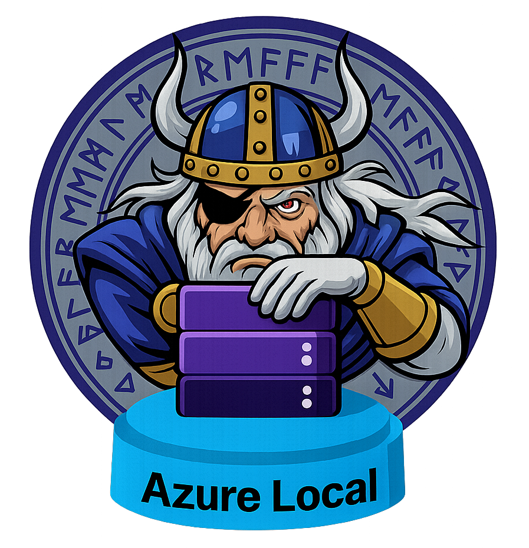

<p align="center">
  
</p>

<h1 align="center">ODIN for Azure Local</h1>

## Version 0.23.03 - Available here: https://aka.ms/ODIN

A browser-based planning toolkit for Azure Local (formerly Azure Stack HCI). ODIN combines architecture design, workload-based hardware sizing, storage planning, network and switch configuration, reference architectures, and deployment/report outputs. Configuration data is processed locally in the browser.

> **Disclaimer:** This tool is provided as-is without Microsoft support. This is an experimental project to help customers accelerate their skills ramp up for Azure Local, while helping IT architects to validate desired configurations.

---

## Table of Contents

- [Features](#features)
- [What's New](#whats-new)
- [Quick Start](#quick-start)
- [Prerequisites Checklist](#prerequisites-checklist)
- [Usage Guide](#usage-guide)
- [Configuration Options](#configuration-options)
- [Export Formats](#export-formats)
- [Browser Compatibility](#browser-compatibility)
- [Troubleshooting](#troubleshooting)
- [Report an Issue and Contributing](#report-an-issue-and-contributing)
- [Best Practices](#best-practices)
- [Security Considerations](#security-considerations)
- [Additional Resources](#additional-resources)
- [License](#license)
- [Version History](#version-history)

---

## Features

### Core Functionality
- **Azure Local Designer**: Guided planning for connected, disconnected, multi-rack, and Microsoft 365 Local deployments, with hyperconverged and disaggregated architecture paths
- **Workload-Based Hardware Sizer**: Size Azure Local infrastructure for VMs, AKS Arc, AVD, Foundry Local, Agentic Retrieval, AI Video Indexer, and GitHub Enterprise Local workloads
- **Discovered-Estate Import**: Import VMware RVTools workbooks or Azure Migrate collector ZIP files to create grouped or per-machine Sizer workloads entirely in the browser
- **Storage Spaces Direct Calculator**: Model maximum volume size, storage-pool consumption, resiliency, provisioning, and single-tier or tiered disk configurations
- **Network and Switch Planning**: Design traffic intents, VLANs, IP ranges, RDMA, switched and switchless storage, external SAN connectivity, and Clos fabrics; generate and validate Cisco NX-OS and Dell OS10 configurations
- **Architecture Knowledge Tools**: Explore outbound-connectivity guidance, interactive AzLoFlows diagrams, and Microsoft Sovereign Private Clouds reference architectures
- **Integrated Planning Workflow**: Transfer deployment information between Sizer and Designer, persist work locally, and share supported configurations using JSON exports or generated URLs
- **Reports and Deployment Outputs**: Generate ARM parameter files, configuration reports, diagrams, Word-compatible documents, PDFs, Markdown, and editable PowerPoint presentations
- **Privacy-Preserving Browser Experience**: Configuration data remains in the browser, with bounded import validation and an opt-out for anonymous aggregate usage counters

---

## What's New

### Version 0.23.03 - Latest Release

> **Sizer now aligns GPU and AI/GitHub workload planning with current Microsoft Learn and GitHub Enterprise Server guidance, including explicit AKS infrastructure ownership.**

**What's new**
- **Model-dependent total GPU sizing** — Total VM mode accepts up to 252 GPUs for four-per-machine models such as L40S and 126 GPUs for two-per-machine models such as A2 across 63 N−1 effective machines (64 physical machines).
- **Per-machine limits preserved** — Per-VM and other workload modes retain each model's supported GPUs-per-machine limit, and switching models clamps oversized values immediately.
- **Instance-wide validation** — combined same-model workloads cannot exceed the selected GPU model's N−1 Azure Local instance capacity, and GPU totals drive machine recommendations; mixed models continue to produce the dedicated homogeneous-GPU conflict.
- **Growth at the GPU ceiling** — Sizer removes and explains the automatic 10% growth allowance when it alone would exceed N−1 GPU capacity; manually selected growth remains unchanged and receives an actionable over-capacity warning.
- **H100 removed** — NVIDIA H100 is no longer offered in Sizer hardware, DDA, or GPU-P choices and has been removed from the current public Sizer schema enum.
- **Learn-aligned GPU support** — Arc VM DDA offers T4, A2, A16, L4, L40, L40S, and RTX Pro 6000; GPU-P offers A2, A10, A16, A40, L4, L40, L40S, and RTX Pro 6000. A100 is removed, and the same support applies to hyperconverged and disaggregated deployments.
- **Right-sized GPU inventory** — automatically managed GPUs per machine are reconciled after machine scaling to preserve N−1 headroom without retaining unnecessary devices, including returning to zero after the final GPU workload is removed while preserving manual inventory.
- **Stable scaling and reset behavior** — Agentic Retrieval production defaults select a compatible GPU and synchronize Hardware Configuration; topology/rack transitions settle without recursive reversal; disaggregated rack capacity is rechecked; and ALDO Reset re-enables all workload cards.
- **Minimum-fit procurement guidance** — the first Sizing Note displays an amber "Advisory" label within the bold "Advisory - minimum-fit hardware" heading when configurations below 32 physical cores or 384 GB memory per machine are minimum-fit results rather than new-hardware procurement baselines.
- **Single Node availability guidance** — Single Node results place a matching Advisory first, explaining that one machine has no live-migration or workload-failover destination and restart-requiring maintenance interrupts workloads.
- **Sizing Notes in design documents** — Sizer recommendations now flow into Designer and appear in both HTML and PowerPoint cluster design documents.
- **Design report fidelity** — reports use the "Azure Local Instance | Design Configuration Report" title, identify Designer-only or Sizer-and-Designer workflow inputs, include each workload's resolved GPU model and mode across document formats, match the Sizer's Advisory styling, and label GPU racks as "GPU Enabled."
- **S2D guidance in design reports** — Single Node, standard, and rack-aware Sizer results show the recommended number of volumes and maximum supported size per volume, then carry the exact calculation and derivation through Designer into HTML, Word, Markdown, and PowerPoint.
- **GPU instance totals** — Sizer-originated reports show the full NVIDIA model name per node and total physical GPU count across the instance.
- **ToR configuration planning link** — Host Networking reports and the Physical Network Configuration PowerPoint slide link to the portable ToR Switch Configuration Generator & Validator for example Cisco and Dell configurations.
- **Infrastructure IP Pool auto-ending** — entering a valid Starting IP in Designer automatically fills the minimum six-address Ending IP without overwriting a manual ending address.
- **AMD Turin catalog coverage** — standard 5th Gen AMD EPYC sizing now includes the catalog-listed 84-core-per-socket option.
- **Cluster-wide GPU-P planning** — Sizer rejects conflicting partition sizes across workloads and links hardware, DDA, GPU-P, and AKS controls to the relevant Microsoft Learn guidance.
- **[No AKS double-counting](https://github.com/Azure/odinforazurelocal/issues/284)** — Foundry Local, Agentic Retrieval, and AI Video Indexer visibly include dedicated AKS Arc infrastructure; add the generic AKS workload only for another independent cluster. GitHub Enterprise Local runs as a GHES appliance VM, not on AKS.
- **Learn-aligned AI sizing** — Foundry Local uses published minimum/recommended worker profiles and per-deployment model-cache storage, while Agentic Retrieval and Video Indexer no longer add undocumented overhead above their published worker requirements.
- **Foundry Local model discovery** — the Worker Profile input links to Microsoft's current Foundry Local model catalog for compatible OSS model exploration without coupling model choice to a fixed sizing preset.
- **GHES feature-aware sizing** — GitHub Enterprise Local defaults to one appliance VM, supports optional active/passive replicas, and adds the documented CPU/memory allowances for GitHub Actions and GitHub Code Security.
- **Validation** — all **1,555 / 1,555** browser tests pass. Reusable Sizer and Designer real-UI validation matrices now complement the static suite for release candidates and relevant PRs, covering rendered-control transitions, synchronization, reset cleanup, outputs, handoffs, responsive layouts, and accessibility.

---

## Quick Start

1. **Open ODIN online**:
   - In a current web browser, go to https://aka.ms/ODIN

2. **Unsure about hardware? Start with the Sizer**:
   - Open the **ODIN Sizer** from the main page or navigate to `sizer/index.html`
   - Add workloads directly, import a VMware RVTools workbook, or import an Azure Migrate collector ZIP
   - Configure deployment type, resiliency, hardware assumptions, and growth headroom
   - Review the recommended hardware (CPU, memory, storage, GPUs, power, and rack space)
   - Click **Configure in Designer** to transfer the sizing results into the Designer wizard automatically

3. **Follow the wizard**:
   - Answer questions about your deployment scenario
   - Configure network settings, storage, and identity options
   - Review the configuration summary in real-time

4. **Export your configuration**:
   - Generate ARM parameters JSON
   - Export full configuration for sharing or backup
   - Download configuration reports

### Disconnected or Offline Access

ODIN can run from a downloaded copy of this repository when the hosted site is unavailable or the planning workstation is disconnected from the internet. This is an end-user access option; no development environment or npm installation is required.

1. Download and extract the repository files to the offline workstation.
2. Open Windows PowerShell in the extracted repository root.
3. Start the included local web server:

   ```powershell
   PowerShell.exe -ExecutionPolicy Bypass -File .\tests\serve.ps1
   ```

4. Open http://localhost:5500 in a current browser.
5. Press `Ctrl+C` in PowerShell when finished.

The Designer, Sizer, S2D Calculator, switch tools, bundled diagrams, imports, and exports run locally. External Microsoft Learn links and anonymous aggregate usage counters require connectivity and are unavailable while fully offline.

---

## Prerequisites Checklist

If you want to deploy Azure Local on physical hardware, before starting, ensure you have:

#### Hardware
- ✅ Azure Local certified hardware (check [Microsoft Hardware Catalog](https://aka.ms/AzureStackHCICatalog))
- ✅ Minimum 1 node (up to 16 for single-site clusters)
- ✅ RDMA-capable network adapters for storage, for multi-node clusters.
- ✅ Compatible Top of Rack (ToR) switches with latest firmware installed.

#### Network
- ✅ Outbound internet connectivity or configured proxy
- ✅ Available IP address ranges for infrastructure and management
- ✅ DNS servers configured and reachable
- ✅ VLAN support (if using tagged VLANs)
- ✅ Network Time Protocol (NTP) configured

#### Azure
- ✅ Active Azure subscription with appropriate permissions
- ✅ Azure Arc resource provider registered
- ✅ Sufficient quota for Azure Local resources
- ✅ Resource group created in target region

#### Identity & Access
- ✅ Active Directory domain and appropriate permissions when using domain-based identity
- ✅ Local Identity prerequisites when using the AD-less connected deployment path

---

## Usage Guide

### Navigation

The Designer experience provides guided workflow of valid cluster design choices and decisions, rather than one fixed sequence. Start by selecting **Connected**, **Disconnected**, **Multi-Rack**, or **Microsoft 365 Local**. Connected and Disconnected deployments then select a **Hyperconverged** or **Disaggregated** architecture where applicable.

Based on those choices, ODIN presents the relevant steps for cloud and region, scale and physical machines, network adapters and traffic intents, storage connectivity, outbound connectivity, IP planning, identity, security, optional services, and deployment outputs. Disconnected and disaggregated designs use dedicated branches for their additional topology and connectivity decisions.

### Key Actions

#### Auto-Save & Resume
- Progress is automatically saved to browser localStorage
- Return anytime and see a "Resume Session" prompt
- Choose to continue or start fresh

#### Export Configuration
- Click **Export** button in the summary panel (right side)
- Saves complete state as timestamped JSON file
- Share with team members or backup for later

#### Import Configuration
- Click **Import** button in the summary panel (right side)
- Select previously exported JSON file
- Review changes and confirm import

#### CIDR Calculator
- Click **Subnet Calculator** button next to the Infrastructure Network CIDR input
- Enter IP/CIDR notation (e.g., 192.168.1.0/24)
- See network details, usable host range, and subnet info

#### Templates
- Click **Load Example Configuration Template** in the summary panel (right side)
- Browse pre-built deployment configurations for common scenarios
- Load a template to pre-populate the wizard with recommended settings

#### Onboarding Walkthrough
- Automatically shown on first visit (can be reset by clearing browser localStorage)
- Step-by-step overlay highlighting key wizard features
- Helps new users understand the workflow quickly

---

## Configuration Options

### Deployment Scenarios

| Deployment Type | Description | Architecture Choices |
|-----------------|-------------|----------------------|
| **Connected** | Azure-connected Azure Local deployment | Hyperconverged or Disaggregated |
| **Disconnected** | Azure Local disconnected operations for air-gapped or limited-connectivity environments | Hyperconverged or Disaggregated, with dedicated management/workload cluster paths |
| **Multi-Rack** | Rack-aware architecture for larger-scale and failure-domain planning | Guided rack-aware configuration |
| **Microsoft 365 Local** | Purpose-built planning path for Microsoft 365 Local workloads | Guided Microsoft 365 Local configuration |

**Hyperconverged** combines compute and Storage Spaces Direct capacity in the Azure Local machines. **Disaggregated** uses external Fibre Channel or iSCSI SAN storage with a Clos leaf-spine fabric and supports up to 64 compute machines across multiple racks.

### Network Intents (Hyperconverged)

| Intent | Description | Adapters |
|--------|-------------|----------|
| **All Traffic** | Single intent for management, compute, and storage | 2 adapters |
| **Compute + Management** | Shared network for VMs and management, dedicated storage | 4+ adapters |
| **Compute + Storage** | Combined compute and storage traffic, dedicated management | 4+ adapters |
| **Custom** | User-defined adapter-to-intent mapping | Flexible (2–8 adapters) |

Disaggregated deployments use a separate intent model with external SAN storage (Fibre Channel or iSCSI) and a Clos leaf-spine fabric — see the **Disaggregated Architecture Wizard** for details.

### Storage Connectivity

| Type | Description | Requirements |
|------|-------------|--------------|
| **Switched** | Traditional ToR switch-based storage networking | ToR switches, any supported scale |
| **Switchless** | Direct node-to-node storage connections | 2–4 nodes, no storage switches |

### Companion Tools

| Tool | Purpose |
|------|---------|
| **ODIN Sizer** | Workload-driven sizing for VMs, AKS Arc, AVD, Foundry Local, Agentic Retrieval, AI Video Indexer, and GitHub Enterprise Local. Supports RVTools and Azure Migrate imports, growth modelling, hardware recommendations, and 3D rack visualization. |
| **S2D Calculator** | Plans maximum supported volume size and storage-pool consumption for Azure Local and Windows Server single-tier or tiered configurations. |
| **Switch Config Generator** | Generates example ToR / BMC / border switch configurations for Cisco NX-OS and Dell OS10, with rack-aware support and infrastructure token replacement. |
| **QoS Validator** | Validates a pasted `show running-config` (Cisco) or `show running-configuration` (Dell OS10) against Azure Local QoS requirements (PFC, ETS, ECN, MTU 9216, system QoS policy, interface-level PFC/trunking). |
| **Knowledge Tab** | Provides outbound-connectivity guidance, the AzLoFlows interactive flow-diagram builder, and Microsoft Sovereign Private Clouds reference architectures with editable PowerPoint export. |

---

## Export Formats

### ARM Parameters JSON
- Azure Resource Manager template parameters
- Ready for deployment with Azure CLI or Portal
- Includes placeholders for values not collected by wizard
- **Copy to Clipboard**: Available on ARM parameters page

### Configuration JSON
- Complete wizard state export
- Version-tagged for compatibility tracking
- Includes timestamp and metadata
- Can be re-imported to restore session

### JSON Schemas (validate exports before import)
- Machine-readable [JSON Schema](https://json-schema.org/) (draft-07) definitions for both export surfaces, so you can generate and **validate** ODIN JSON outside the UI (CI/CD, Terraform, scripts) before importing it
- **Designer**: [`docs/json-schema/odin-design.schema.json`](docs/json-schema/odin-design.schema.json) — published at `https://azure.github.io/odinforazurelocal/docs/json-schema/odin-design.schema.json`
- **Sizer**: [`docs/json-schema/odin-sizer.schema.json`](docs/json-schema/odin-sizer.schema.json) — published at `https://azure.github.io/odinforazurelocal/docs/json-schema/odin-sizer.schema.json`
- See the **[JSON Schema reference & examples](docs/json-schema/README.md)** for both envelopes side by side, required vs optional fields, and how to validate from any language (ajv, python-jsonschema, or VS Code `$schema`)

### Configuration Report
- Comprehensive configuration report covering deployment scenario, network, intents, IP plan, identity, security, and SDN options
- Download as a Word-compatible HTML `.doc`, **Markdown** with embedded diagrams, or an editable `.pptx` deck generated directly in the browser
- Includes decision rationale, network diagrams (SVG / Mermaid / draw.io), and a 2D rack diagram
- Print-friendly formatting (browser "Save as PDF" supported)

### Sizer Report
- **Save as PDF** and **Download Word** for sized hardware results
- Includes per-workload breakdown, hardware configuration, capacity bars, and power / heat / rack-space estimates

---

## Browser Compatibility

### Supported Browsers
- Use a current version of **Microsoft Edge**, **Google Chrome**, **Mozilla Firefox**, or **Safari**
- Chromium-based browsers are used for the automated browser test suite

### Required Features
- ES6+ JavaScript support
- CSS Custom Properties
- Flexbox and Grid
- localStorage API
- File API (for import/export)

### Known Limitations
- Internet Explorer is **not supported**
- Local persistence depends on the browser allowing `localStorage`; private-browsing behavior varies by browser and policy
- File downloads, clipboard access, and very large imports may be constrained by browser or device settings

---

## Troubleshooting

### Common Issues

#### "Previous Session Found" doesn't appear
- localStorage may be disabled in browser settings
- Private/Incognito browsing or enterprise policy may restrict or clear localStorage
- Clear browser cache and try again

#### Export/Import not working
- Check browser console for errors
- Ensure pop-up blocker isn't preventing downloads
- Verify file is valid JSON (use JSON validator)

#### Validation errors on import
- Confirm the file was exported by the correct ODIN tool (Designer and Sizer use different formats)
- Review the displayed validation message for unsupported values, malformed JSON, or import-size limits
- Legacy exports are migrated where supported; exporting a fresh configuration is useful when diagnosing an unsupported format

### Debugging

Enable detailed logging in browser console:
1. Open Developer Tools (F12)
2. Go to Console tab
3. Look for errors or warnings
4. Check localStorage: `localStorage.getItem('azureLocalWizardState')`

---

## Report an Issue and Contributing

- Report bugs or request new features via GitHub [Issues](https://github.com/Azure/odinforazurelocal/issues)
- Include browser version, OS, screenshot if possible, and steps to reproduce the issue
- Provide exported config (sanitized) if required to recreate the problem

For detailed contribution guidelines, see [CONTRIBUTING.md](CONTRIBUTING.md).

---

## Best Practices

### Using the Wizard
1. **Review Prerequisites** - Click "Prerequisites" before starting
2. **Try Templates** - Load a pre-built template for common scenarios
3. **Save Progress** - Export configuration at major milestones
4. **Validate Early** - Use real-time validation to catch errors
5. **Use Calculator** - CIDR calculator helps avoid subnet conflicts

### Network Planning
1. **Document IP Ranges** - Keep track of all CIDRs and ranges
2. **Avoid Overlaps** - Use CIDR calculator to verify no conflicts
3. **Plan for Growth** - Size infrastructure pool with headroom
4. **Test DNS** - Verify DNS resolution before deployment
5. **Review Gateway** - Ensure default gateway is outside IP pools

### Configuration Management
1. **Export Regularly** - Save configuration at each major decision
2. **Version Control** - Keep exports with version tags
3. **Share with Team** - Use export/import to collaborate
4. **Document Changes** - Note modifications in separate doc
5. **Backup Configs** - Store exports in version control system

---

## Security Considerations

### Input Sanitization
- Imported files, shared URLs, restored state, and generated documents are treated as untrusted input at their rendering and parsing boundaries
- CIDR, IP, numeric, enum, and identifier fields use context-specific validation
- File imports are structure- and size-validated before application; Azure Migrate ZIP imports also validate archive paths, encryption, duplicates, and extracted content

### Data Storage
- Configuration inputs, imported inventories, and generated outputs stay in the browser and may be persisted in localStorage
- Anonymous integer-only page-view and feature-use counters are sent to Firebase; no configuration values, machine names, IP addresses, or user identifiers are included
- Usage counters can be disabled from the navigation toggle and are also disabled when the browser sends Do Not Track or Global Privacy Control
- Clear localStorage on shared computers

### Best Practices
- Don't include sensitive credentials in configurations
- Don't share exports containing private IP ranges publicly
- Review imported configs before applying
- Use prerequisites checklist to verify security requirements

---

## Additional Resources

### Official Documentation
- [Azure Local Documentation](https://learn.microsoft.com/azure/azure-local/)
- [Network Reference Patterns](https://learn.microsoft.com/azure/azure-local/plan/network-patterns-overview)
- [Azure Arc Documentation](https://learn.microsoft.com/azure/azure-arc/)
- [Azure Local Pricing](https://azure.microsoft.com/pricing/details/azure-local/)

### Community
- [Azure Arc - TechCommunity](https://techcommunity.microsoft.com/category/azure/blog/azurearcblog)
- [Azure Local - GitHub Supportability Forum](https://github.com/Azure/AzureLocal-Supportability)

### For Developers & Automation
- [JSON Schema reference & examples](docs/json-schema/README.md) — validate ODIN exports outside the UI (CI/CD, Terraform, scripts)
- [`odin-design.schema.json`](docs/json-schema/odin-design.schema.json) — Designer export schema (draft-07)
- [`odin-sizer.schema.json`](docs/json-schema/odin-sizer.schema.json) — Sizer export schema (draft-07)

---

## License

Published under [MIT License](/LICENSE). This project is provided as-is, without warranty or support, it is intended for planning and automation example purposes. See official Azure documentation for deployment guidance and support.

---

## Acknowledgments

Built for the Azure Local community to simplify network architecture planning and deployment configuration.

**Version**: 0.23.03<br>
**Last Updated**: August 2026<br>
**Compatibility**: Azure Local 2506+

---

For questions, feedback, or support, please visit the [GitHub repository](https://github.com/Azure/odinforazurelocal) or consult the official Azure Local documentation.

---

## Version History

Historical release summaries have moved to the [ODIN Version History](docs/version-history/README.md). For the complete change record, see [CHANGELOG.md](CHANGELOG.md).
